# Virtual AI Spotter


> 🚀 **Major Update**: The core engine has been refactored for **Production Readiness**.
> Full rewrite around **FSM-based counting** (debouncing + hysteresis), a **modular Feedback System**, **One Euro Filter** signal smoothing, and a **pure-math Geometry Engine** (zero NumPy overhead).
> Architecture highlights: Factory + Registry extensibility, Protocol-based DI, Session Manager with set/rest orchestration, hands-free **Gesture Control**, **i18n** (IT/EN), **SQLite** persistence, and an optimized **HUD** with ROI alpha blending — all validated by a **136-test suite** running at **30+ FPS on CPU**.

## Project Overview
**Virtual AI Spotter** is a real-time Computer Vision assistant designed to act as an intelligent personal trainer. It utilizes state-of-the-art Deep Learning and geometric analysis to provide automatic repetition counting, exercise suggestions, and instant feedback on execution form.

## Technology Stack
- **Core AI**:  YOLOv8 (Pose Estimation)
- **Framework**:  PyTorch
- **Computer Vision**:  OpenCV
- **Logic**: 📐 Geometric Vector Analysis & ⚙️ Finite State Machines (FSM)
- **Cloud**:  AWS (Lambda, DynamoDB, S3)
- **Database**:   SQLite (Local), DynamoDB (Cloud)

## Key Features
- **Real-time Pose Estimation**: High-speed, accurate body tracking using YOLOv8-pose.
- **Action Classification**: Distinguishes between different exercises and movement phases.
- **Automatic Rep Counting**: Precision counting based on **Finite State Machines (FSM)** with debouncing and hysteresis.
- **Form Correction**: Instant feedback on posture (e.g., "Lower your hips", "Straighten back") using a modular **Feedback System**.
- **Multi-language Support**: Fully localized interface (Italian/English) with dynamic switching.
- **High-Performance HUD**: Optimized Visualizer engine using ROI-based Alpha Blending for smooth, transparent overlays.
- **Gesture Control**: Hands-free interaction using pose-based gestures (e.g., raised arm to skip rest periods).
- **Extensible Architecture**: Factory + Registry Pattern enables adding new exercises without modifying core code. Dependency Injection via Python Protocols for testability.

## MVP Scope (Minimum Viable Product)
The initial release focuses on 4 fundamental exercises that test different aspects of the tracking engine:

1.  **Squat (Lower Body)**
    *   *Focus*: Knee and hip angles.
    *   *Logic*: Standard FSM (Down < Threshold, Up > Threshold).
    *   *Feedback*: Squat depth and back alignment.

2.  **Push-up (Upper Body)**
    *   *Focus*: Body alignment and elbow extension.
    *   *Challenges*: Robustness against occlusion (body close to floor).
    *   *Feedback*: "Keep back straight" via body angle analysis.

3.  **Bicep Curl (Isolation)**
    *   *Focus*: Elbow flexion/extension.
    *   *Logic*: Inverted FSM Logic (Up/Flexion < Threshold, Down/Extension > Threshold).
    *   *Feedback*: Full extension check.

4.  **Plank (Static Core)**
    *   *Focus*: Maintaining a straight line (Shoulder-Hip-Ankle alignment).
    *   *Logic*: `StaticDurationCounter` FSM with countdown, active timer, and form break detection.

## System Architecture

The project follows a **Layered Architecture** with clear separation of concerns, enabling testability, extensibility (Open/Closed Principle), and adherence to Domain-Driven Design (DDD) principles.

### Data Flow Diagram

```mermaid
%%{init: {'theme': 'neutral'}}%%
graph LR
    subgraph INFRA["🔌 Infrastructure Layer"]
        direction TB
        A["📷 Webcam"] --> B["🤖 YOLOv8 Pose"]
        B --> C["🔑 Keypoint Extractor"]
    end

    subgraph CORE["⚡ Core Domain"]
        direction TB
        D["📐 Geometry Engine"] --> E["⚙️ FSM"]
        E --> F["💬 Feedback"]
    end

    subgraph UI["🎨 Presentation Layer"]
        direction TB
        G["🖥️ Visualizer"] --> H["📊 Renderers"]
    end

    C ==> D
    F ==> G

    %% Layer styling - pastel fills, semantic strokes
    style INFRA fill:#f3f4f6,stroke:#6b7280,stroke-width:2px,color:#374151
    style CORE fill:#eff6ff,stroke:#3b82f6,stroke-width:2px,color:#1e40af
    style UI fill:#f5f3ff,stroke:#8b5cf6,stroke-width:2px,color:#5b21b6

    %% Node styling - light backgrounds, dark text
    style A fill:#ffffff,stroke:#9ca3af,stroke-width:1px,color:#1f2937
    style B fill:#ffffff,stroke:#9ca3af,stroke-width:1px,color:#1f2937
    style C fill:#ffffff,stroke:#9ca3af,stroke-width:1px,color:#1f2937
    style D fill:#ffffff,stroke:#60a5fa,stroke-width:1px,color:#1e3a8a
    style E fill:#ffffff,stroke:#60a5fa,stroke-width:1px,color:#1e3a8a
    style F fill:#ffffff,stroke:#60a5fa,stroke-width:1px,color:#1e3a8a
    style G fill:#ffffff,stroke:#a78bfa,stroke-width:1px,color:#4c1d95
    style H fill:#ffffff,stroke:#a78bfa,stroke-width:1px,color:#4c1d95

    linkStyle default stroke:#64748b,stroke-width:1px
    linkStyle 3 stroke:#059669,stroke-width:2px
    linkStyle 4 stroke:#059669,stroke-width:2px
```



### 1. Core Domain (`src/core`)

Business logic is fully isolated from external dependencies:

*   **Entities** (`src/core/entities/`): Domain objects following DDD — `Session`, `User`, `WorkoutState`, `UIState`.
*   **FSM Core** (`fsm.py`): Reusable `RepetitionCounter` with debouncing, hysteresis, and support for standard/inverted logic.
*   **Feedback System** (`feedback.py`): Aggregates form-check rules and prioritizes messages.
*   **Factory + Registry** (`factory.py`, `registry.py`): Exercises self-register via `@register_exercise` decorator — no if/elif chains.
*   **Session Manager** (`session_manager.py`): Orchestrates workout flow, rest periods, and set progression.
*   **Dependency Injection**: Abstractions defined in `protocols.py` (PoseDetector, KeypointExtractor, DatabaseManagerProtocol) enable mock injection for CI/CD testing.

### 2. Infrastructure Layer (`src/infrastructure`)

Handles external integrations, decoupled from business logic:

*   **AI Inference** (`ai_inference.py`): YOLO model wrapper implementing `PoseDetector` protocol.
*   **Keypoint Extractor** (`keypoint_extractor.py`): Transforms raw YOLO output to standardized 17×3 arrays.
*   **Webcam** (`webcam.py`): Frame capture abstraction for easy replacement with video files or streams.

### 3. UI & Visualization (`src/ui`)

Presentation layer with separated rendering responsibilities:

*   **Visualizer** (`visualizer.py`): Facade coordinating all renderers.
*   **Dashboard Renderer**: Draws HUD panels (reps, sets, feedback text).
*   **Overlay Renderer**: Transparent overlays using ROI-based alpha blending.
*   **Skeleton Renderer**: Draws pose skeleton connections.

### 4. Signal Processing (`src/utils`)

*   **Geometry Engine** (`geometry.py`): Pure `math`-based vector calculations (no NumPy overhead).
*   **Smoothing** (`smoothing.py`): One Euro Filter for jitter reduction.
*   **Circular Buffer**: `collections.deque` for temporal smoothing (30-frame window).

### 5. Hybrid Cloud Architecture

*   **Edge**: Real-time inference on local PC/GPU for zero-latency feedback.
*   **Cloud (AWS)**: Planned async sync to DynamoDB/S3 via Lambda.

### 6. Quality Assurance

*   **Test Suite** (`tests/`): 136 automated tests across 13 test files — FSM, Geometry, SessionManager, Gesture Detection, DI mocks, exercise integration, and state display coverage.
*   **Verification Scripts**: Manual validation tools for debouncing, i18n, refactoring.

---

<details>
<summary>📂 <strong>View Project Structure (File Tree)</strong></summary>

```
├── 📁 .github
│   └── 📁 workflows                          # CI/CD pipeline definitions
├── 📁 assets
│   └── 📁 models
│       └── 📄 yolov8n-pose.pt                 # Pre-trained YOLOv8 pose model
├── 📁 config
│   ├── 🐍 settings.py                         # Global constants, thresholds, colors
│   └── 🐍 translation_strings.py              # i18n strings (IT/EN)
├── 📁 scripts
│   ├── 🐍 check_cam.py                        # Camera connectivity check
│   └── 🐍 verify_refactor.py                  # Post-refactor sanity checks
├── 📁 src
│   ├── 📁 core                                # Business logic (framework-agnostic)
│   │   ├── 📁 entities                        # Domain objects (DDD)
│   │   │   ├── 🐍 session.py                  # Workout session dataclass
│   │   │   ├── 🐍 ui_state.py                 # Rendering state container
│   │   │   ├── 🐍 user.py                     # User profile dataclass
│   │   │   └── 🐍 workout_state.py            # Workout FSM states (ACTIVE/REST/FINISHED)
│   │   ├── 🐍 app.py                          # Composition root & main loop
│   │   ├── 🐍 config_types.py                 # TypedDict definitions for configs
│   │   ├── 🐍 exceptions.py                   # Custom exception hierarchy (SpotterError)
│   │   ├── 🐍 factory.py                      # Exercise factory (creates instances)
│   │   ├── 🐍 feedback.py                     # Rule-based form correction engine
│   │   ├── 🐍 fsm.py                          # RepetitionCounter & StaticDurationCounter
│   │   ├── 🐍 gesture_detector.py             # Pose-based gesture recognition
│   │   ├── 🐍 interfaces.py                   # ABCs: Exercise, VideoSource, StateDisplayInfo
│   │   ├── 🐍 protocols.py                    # DI protocols: PoseDetector, DBManager
│   │   ├── 🐍 registry.py                     # @register_exercise decorator & registry
│   │   └── 🐍 session_manager.py              # Set/rest/rep orchestration
│   ├── 📁 data                                # Persistence layer
│   │   ├── 🐍 db_manager.py                   # SQLite CRUD operations
│   │   └── 📄 schema.sql                      # Database schema definition
│   ├── 📁 exercises                           # Concrete exercise implementations
│   │   ├── 🐍 __init__.py                     # Auto-imports for registration
│   │   ├── 🐍 curl.py                         # Bicep Curl (inverted FSM)
│   │   ├── 🐍 plank.py                        # Plank (static hold timer)
│   │   ├── 🐍 pushup.py                       # Push-Up (bilateral + form check)
│   │   └── 🐍 squat.py                        # Squat (standard FSM)
│   ├── 📁 infrastructure                      # External system adapters
│   │   ├── 🐍 ai_inference.py                 # YOLO model wrapper (PoseDetector)
│   │   ├── 🐍 keypoint_extractor.py           # Raw YOLO output → 17×3 arrays
│   │   └── 🐍 webcam.py                       # OpenCV camera capture (VideoSource)
│   ├── 📁 ui                                  # Presentation layer
│   │   ├── 🐍 cli.py                          # Interactive workout setup prompts
│   │   ├── 🐍 dashboard_renderer.py           # HUD panel (reps, sets, state)
│   │   ├── 🐍 overlay_renderer.py             # Full-screen REST/FINISHED overlays
│   │   ├── 🐍 skeleton_renderer.py            # Pose skeleton & angle arcs
│   │   └── 🐍 visualizer.py                   # Renderer facade (delegates to above)
│   └── 📁 utils                               # Signal processing utilities
│       ├── 🐍 geometry.py                     # Pure-math angle calculations
│       ├── 🐍 performance.py                  # FPS counter & timing helpers
│       └── 🐍 smoothing.py                    # One Euro Filter for jitter reduction
├── 📁 tests                                   # Automated test suite (136 tests)
│   ├── 📁 mocks                               # Test doubles
│   │   ├── 🐍 __init__.py
│   │   ├── 🐍 mock_pose.py                    # Fake PoseDetector for DI tests
│   │   └── 🐍 mock_video.py                   # Fake VideoSource for DI tests
│   ├── 🐍 __init__.py
│   ├── 🐍 helpers.py                          # Shared fixtures (UIState, dummy frames)
│   ├── 🐍 test_app_di.py                      # Dependency injection wiring tests
│   ├── 🐍 test_db_manual.py                   # SQLite persistence tests
│   ├── 🐍 test_entities_manual.py             # Domain entity tests
│   ├── 🐍 test_exercise_integration.py        # End-to-end rep counting & form feedback
│   ├── 🐍 test_exercises.py                   # Exercise process_frame unit tests
│   ├── 🐍 test_fsm.py                         # FSM state transitions & debouncing
│   ├── 🐍 test_geometry.py                    # Angle calculation edge cases
│   ├── 🐍 test_gesture.py                     # Gesture recognition tests
│   ├── 🐍 test_plank.py                       # Plank lifecycle & timer tests
│   ├── 🐍 test_pose_estimator.py              # PoseEstimator protocol tests
│   ├── 🐍 test_session_manager.py             # Workout flow & state transitions
│   ├── 🐍 test_smoothing.py                   # One Euro Filter convergence tests
│   ├── 🐍 test_visualizer.py                  # Renderer + state display mapping tests
│   ├── 🐍 verify_debouncing.py                # Manual debouncing validation
│   ├── 🐍 verify_features.py                  # Manual feature smoke tests
│   ├── 🐍 verify_i18n.py                      # Manual i18n string verification
│   └── 🐍 verify_refactor.py                  # Manual refactor validation
├── ⚙️ .gitignore
├── 📄 LICENSE                                  # AGPL v3
├── 📝 README.md
├── 🐍 main.py                                 # Application entry point
└── 📄 requirements.txt                        # Python dependencies
```

</details>

---

## 🗺️ Roadmap

- [x] **Project Initialization**
    - [x] Architecture & Tech Stack Definition
    - [x] Repository Structure & `.gitignore`
- [x] **Core Engineering**
    - [x] Abstract `Exercise` Class
    - [x] YOLOv8 Integration
    - [x] **FSM & Feedback Architecture Refactoring**
    - [x] **Performance Optimization (Math + ROI Visualizer)**
- [x] **Exercise Logic (MVP)**
    - [x] Squat (Depth & Form)
    - [x] Push-up (Occlusion handling)
    - [x] Bicep Curl (Inverted Logic)
    - [x] Plank (Static stability check)
- [ ] **Cloud & DevOps**
    - [ ] AWS Lambda & DynamoDB implementation details
    - [x] Unit Testing Suite (`tests/`)
    - [ ] CI/CD Pipeline (GitHub Actions)
